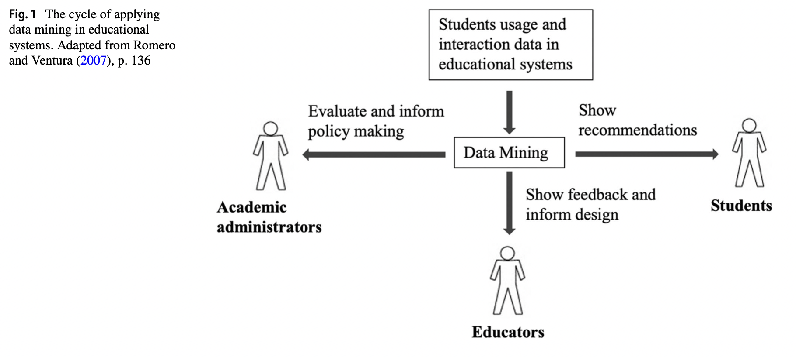
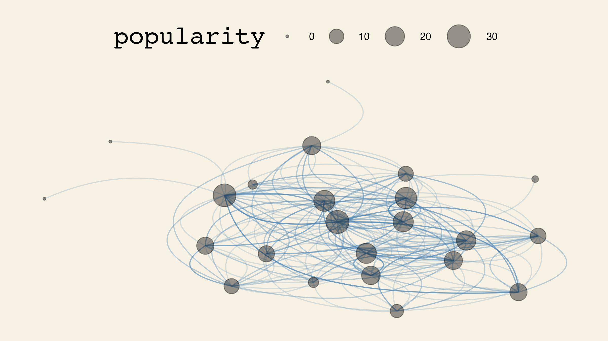
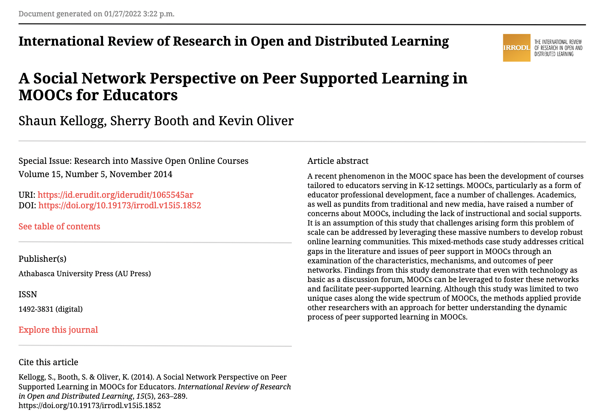
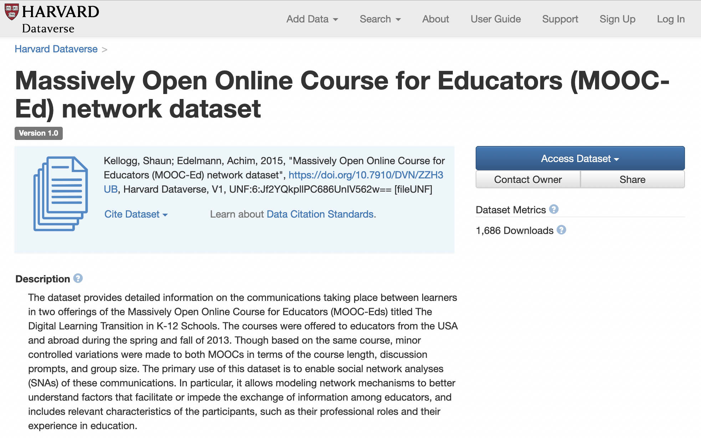
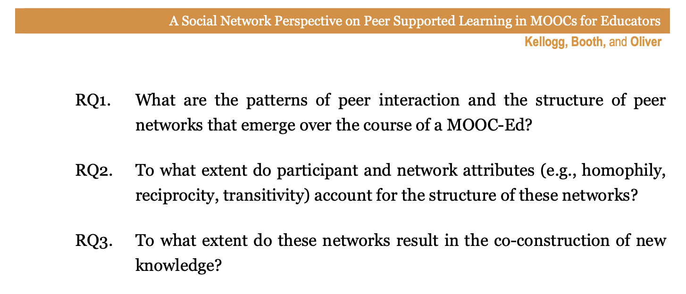
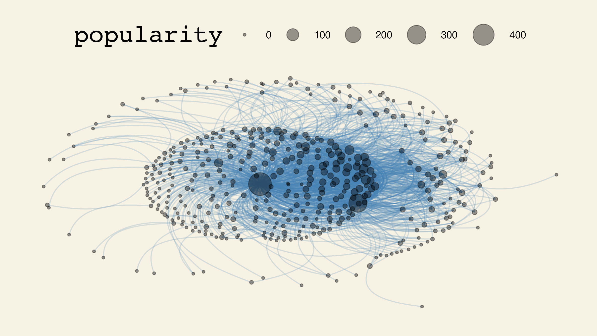
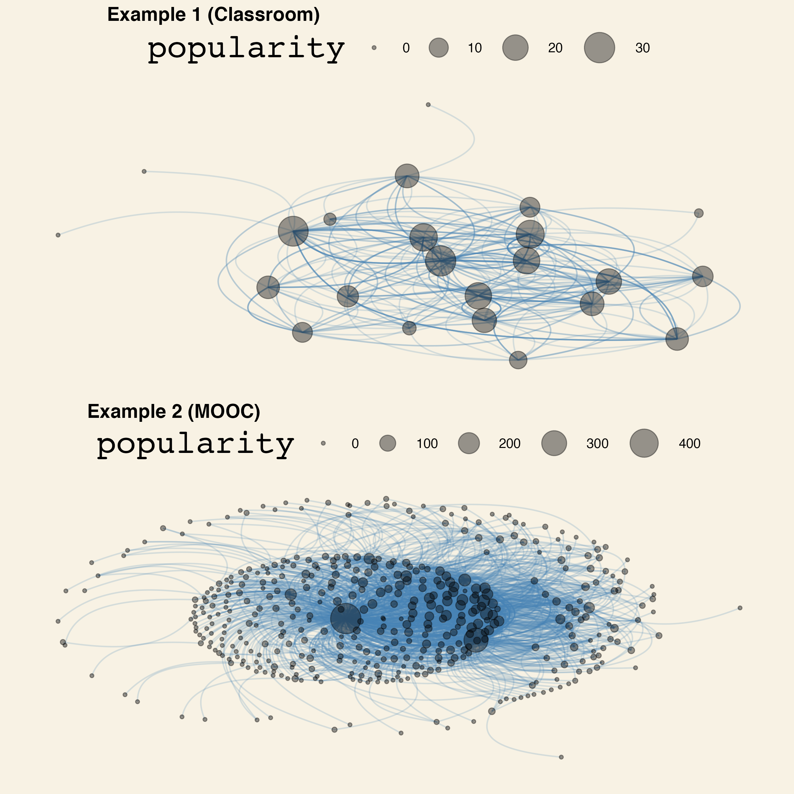

```{r setup, include=FALSE}
usethis::use_git_ignore(c("*.csv", "*.rds"))
options(htmltools.dir.version = FALSE)

library(knitr)
library(tidyverse)
library(xaringan)
library(fontawesome)
library(igraph)
library(tidygraph)
library(ggraph)
library(ggthemes)
library(cowplot)
library(kableExtra)
```

class: inverse, center, middle

# `r fa("far fa-images", fill = "#fff")`

**View the slides:** 

[bretsw.com/eme6356-su23-module3](https://bretsw.com/eme6356-su23-module3)

---

class: inverse, center, middle

# `r fa("thumbs-up", fill = "#fff")` <br><br> Looking Back at Module 2

---

# `r fa("thumbs-up", fill = "#fff")` Data Doubles

```{r, out.width = "640px", echo = FALSE, fig.align = "center"}

```

--

- How well can data capture our multifaceted selves?

--

- Do data shape our identities?

---

# `r fa("thumbs-up", fill = "#fff")` `r fa("thumbs-down", fill = "#fff")` Double-Edged Sword

```{r, out.width = "600px", echo = FALSE, fig.align = "center"}

```

--

- How can data **help**? `r fa("thumbs-up", fill = "#782F40")` alerts and notifications

--

- How can data **hurt**? `r fa("thumbs-down", fill = "#782F40")` obsessive checking/tracking

---

# `r fa("thumbs-up", fill = "#fff")` What's the Point?

```{r, out.width = "600px", echo = FALSE, fig.align = "center"}

```

--

- What’s the purpose of knowing how many emails one sends? 

--

- Do parents ever show data patterns to their kids? 

--

- Would this even help them self-regulate? 

---

# `r fa("thumbs-down", fill = "#fff")` Cautions

```{r, out.width = "640px", echo = FALSE, fig.align = "center"}

```

--

- Who **owns** the data? The interpretation?

--

- **Bias** exists in human interpretation and is baked into data analytics

---

class: inverse, center, middle

# `r fa("fas fa-question", fill = "#fff")` <br><br> Module 2 <br> Final Thoughts?

---

class: inverse, center, middle

# `r fa("fas fa-chart-line", fill = "#fff")` <br><br> Module 3: <br> Learning Analytics

---

class: inverse, center, middle

# `r fa("fas fa-chart-line", fill = "#fff")` <br><br> **Defining Analytics**

---

class: inverse, center, middle

# `r fa("fas fa-chart-line", fill = "#fff")` <br><br> **Defining Analytics**

**Measure `r fa("fas fa-arrow-right", fill = "#fff")` Collect `r fa("fas fa-arrow-right", fill = "#fff")` Analyze `r fa("fas fa-arrow-right", fill = "#fff")` Report**

---

class: inverse, center, middle

# `r fa("fas fa-chart-line", fill = "#fff")` <br><br> **Learning Analytics**

**(Performance at School)**

---

# `r fa("fas fa-chart-line", fill = "#fff")` Performance at School

```{r, out.width = "600px", echo = FALSE, fig.align = "center"}
include_graphics("img/classroom.jpg")
```

Measure `r fa("fas fa-arrow-right", fill = "#782F40")` Collect `r fa("fas fa-arrow-right", fill = "#782F40")` Analyze `r fa("fas fa-arrow-right", fill = "#782F40")` Report

--

### `r fa("fas fa-question", fill = "#782F40")` **What might we measure?**

---

# `r fa("fas fa-chart-line", fill = "#fff")` Performance at School

```{r, out.width = "600px", echo = FALSE, fig.align = "center"}
include_graphics("img/classroom.jpg")
```

- How did student learning changed when doing school from home, if at all?

--

- With whom do students interact in class discussions?

--

- From whom do teachers seek professional advice?

---

# `r fa("fas fa-chart-line", fill = "#fff")` Performance at School

```{r, out.width = "100%", echo = FALSE, fig.align = "center"}

```

<div class="caption">
<p>TechTrends article: "The History and Development of Learning Analytics in Learning, Design, & Technology Field" (<a href="https://doi.org/10.1007/s11528-022-00720-1" target="_blank">Ye, 2022</a>)</p>
</div>

---

class: inverse, center, middle

# `r fa("fas fa-dice-one", fill = "#fff")` <br><br> **Learning Analytics** <br><br> Example 1

---

# `r fa("fas fa-dice-one", fill = "#fff")` Learning Analytics Example 1

**Online Class Discussion - Social Network Analysis**

--

```{r}
edgelist1 <- 
  read_csv("data/meteakca_edgelist.csv", 
           show_col_types = FALSE) %>%
  mutate(group = week,
         week = substr(week, 1, 1)
         ) %>% 
  group_by(from, to) %>% 
  mutate(weight = n())
glimpse(edgelist1)
```

---

# `r fa("fas fa-dice-one", fill = "#fff")` Learning Analytics Example 1

**Online Class Discussion - Social Network Analysis**

```{r}
head(edgelist1, 15)
```

--

### `r fa("fas fa-question", fill = "#782F40")` **What might we measure?**

---

# `r fa("fas fa-dice-one", fill = "#fff")` Learning Analytics Example 1

**Online Class Discussion - Social Network Analysis**

```{r, message=FALSE, warning=FALSE}
sociogram1 <-
  tidygraph::as_tbl_graph(edgelist1) %>%
  mutate(popularity = centrality_degree(mode = 'in')) %>%
  ggraph(layout = 'kk') +
  geom_edge_arc(alpha = .2, 
                width = .5, 
                strength = .5,
                color = 'steelblue'
  ) +
  geom_node_point(alpha = .4, aes(size = popularity)) +
  scale_size(range = c(1,10)) +
  theme_wsj() + 
  scale_colour_wsj("colors6") +
  theme(axis.line=element_blank(),
        axis.text.x=element_blank(), axis.text.y=element_blank(),
        axis.ticks.x =element_blank(), axis.ticks.y =element_blank(),
        axis.title.x=element_blank(), axis.title.y=element_blank(),
        panel.background=element_blank(), panel.border=element_blank(),
        panel.grid.major=element_blank(), panel.grid.minor=element_blank())
```

---

# `r fa("fas fa-dice-one", fill = "#fff")` Learning Analytics Example 1

**Online Class Discussion - Social Network Analysis**

```{r, out.width = "100%", echo = FALSE, message=FALSE, warning=FALSE, fig.align = "center"}
ggsave(plot = sociogram1, "img/3-sociogram1.png", width = 8, height = 4.5)

```

--

### `r fa("fas fa-shoe-prints", fill = "#782F40")` **Next step:** Look at the network by group or by week

---

# `r fa("fas fa-dice-one", fill = "#fff")` Learning Analytics Example 1

**Online Class Discussion - Social Network Analysis**

There are quite a few descriptive measures of networks:

--

- **Order:** number of nodes/vertices (students, in this case)

--

- **Size:** number of edges/connections (responses, in this case)

--

- **Reciprocity:** mutuality

--

- **Transitivity:** clustering

--

- **Diameter:** similar to degrees of separation

--

- **Density:** out of all possible connections, percentage that have been made

--

- **Node degree:** number of connections

--

- **Sentiment score:** how positive or negative in aggregate

--

- Character count, Word count, Length of threads

---

# `r fa("fas fa-dice-one", fill = "#fff")` Learning Analytics Example 1

**Online Class Discussion - Social Network Analysis**

Analyze the network:

--

```{r}
graph1 <- tidygraph::as_tbl_graph(edgelist1)
```

--

- **Order:** `r igraph::gorder(graph1)`

--

- **Size:** `r igraph::gsize(graph1)`

--

- **Reciprocity:** `r igraph::reciprocity(graph1)`

--

- **Transitivity:** `r igraph::transitivity(graph1)`

--

- **Diameter:** `r igraph::diameter(graph1)`

--

- **Density:** `r igraph::edge_density(graph1)`

--

- **Node degree:** `r median(igraph::degree(graph1))`

---

class: inverse, center, middle

# `r fa("fas fa-dice-two", fill = "#fff")` <br><br> **Learning Analytics** <br><br> Example 2

---

# `r fa("fas fa-dice-two", fill = "#fff")` Learning Analytics Example 2

**Massive Online Open Course (MOOC) Discussion - Social Network Analysis**

```{r, out.width = "600px", echo = FALSE, fig.align = "center"}

```

**Article:** [A social network perspective on peer supported learning in MOOCs for educators ](http://www.irrodl.org/index.php/irrodl/article/view/1852) (Kellogg, Booth, & Oliver, 2014)

---

# `r fa("fas fa-dice-two", fill = "#fff")` Learning Analytics Example 2

**Massive Online Open Course (MOOC) Discussion - Social Network Analysis**

```{r, out.width = "600px", echo = FALSE, fig.align = "center"}

```

**Data source:** [Massively Open Online Course for Educators (MOOC-Ed) network dataset](https://dataverse.harvard.edu/dataset.xhtml;jsessionid=9ad052693563b29056a88d490182?persistentId=doi%3A10.7910%2FDVN%2FZZH3UB&version=&q=&fileTypeGroupFacet=&fileAccess=&fileSortField=name&fileSortOrder=desc)]

---

# `r fa("fas fa-dice-two", fill = "#fff")` Learning Analytics Example 2

**Massive Online Open Course (MOOC) Discussion - Social Network Analysis**

```{r, out.width = "100%", echo = FALSE, fig.align = "center"}

```

---

# `r fa("fas fa-dice-two", fill = "#fff")` Learning Analytics Example 2

**Massive Online Open Course (MOOC) Discussion - Social Network Analysis**

```{r}
edgelist2 <- 
  read_csv("data/DLT1 Edgelist.csv", 
           show_col_types = FALSE) %>%
  group_by(Sender, Receiver) %>% 
  mutate(Weight = n()) %>%
  ungroup() %>%
  relocate(Sender, Receiver, Weight)
  
glimpse(edgelist2)
```

---

# `r fa("fas fa-dice-two", fill = "#fff")` Learning Analytics Example 2

**Massive Online Open Course (MOOC) Discussion - Social Network Analysis**

```{r}
head(edgelist2, 15)
```

---

# `r fa("fas fa-dice-two", fill = "#fff")` Learning Analytics Example 2

**Massive Online Open Course (MOOC) Discussion - Social Network Analysis**

Analyze the network:

--

```{r}
graph2 <- tidygraph::as_tbl_graph(edgelist2)
```

--

- **Order:** `r igraph::gorder(graph2)`

--

- **Size:** `r igraph::gsize(graph2)`

--

- **Reciprocity:** `r igraph::reciprocity(graph2)`

--

- **Transitivity:** `r igraph::transitivity(graph2)`

--

- **Diameter:** `r igraph::diameter(graph2)`

--

- **Density:** `r igraph::edge_density(graph2)`

--

- **Node degree:** `r median(igraph::degree(graph2))`

---

# `r fa("fas fa-dice-two", fill = "#fff")` Learning Analytics Example 2

**Massive Online Open Course (MOOC) Discussion - Social Network Analysis**

```{r}
sociogram2 <-
  graph2 %>%
  mutate(popularity = centrality_degree(mode = 'in')) %>%
  ggraph(layout = 'kk') +
  geom_edge_arc(alpha = .2, 
                width = .5, 
                strength = .5,
                color = 'steelblue'
  ) +
  geom_node_point(alpha = .4, aes(size = popularity)) +
  scale_size(range = c(1,10)) +
  theme_wsj() + 
  scale_colour_wsj("colors6") +
  theme(axis.line=element_blank(),
        axis.text.x=element_blank(), axis.text.y=element_blank(),
        axis.ticks.x =element_blank(), axis.ticks.y =element_blank(),
        axis.title.x=element_blank(), axis.title.y=element_blank(),
        panel.background=element_blank(), panel.border=element_blank(),
        panel.grid.major=element_blank(), panel.grid.minor=element_blank())
```

---

# `r fa("fas fa-dice-two", fill = "#fff")` Learning Analytics Example 2

**Massive Online Open Course (MOOC) Discussion - Social Network Analysis**

```{r, out.width = "100%", echo = FALSE, fig.align = "center"}
ggsave(plot = sociogram2, "img/3-sociogram2.png", width = 8, height = 4.5)

```

---

# `r fa("fas fa-dice-two", fill = "#fff")` Learning Analytics Example 2

**Massive Online Open Course (MOOC) Discussion - Social Network Analysis**

```{r}
dlt1_no <- 
  read_csv("data/DLT1 Nodes.csv", show_col_types = FALSE)
glimpse(dlt1_no)
```

--

### `r fa("fas fa-shoe-prints", fill = "#782F40")` **Next step:** Infer network structure from participant and network attributes 

--

(try using **[brms](https://paul-buerkner.github.io/brms/)**: An R package for Bayesian multilevel models using Stan)

---

class: inverse, center, middle

# `r fa("fas fa-dice-one", fill = "#fff")` `r fa("fas fa-dice-two", fill = "#fff")` <br><br> **Learning Analytics** <br><br> Comparing Examples 1 & 2

---

# `r fa("fas fa-dice-one", fill = "#fff")` `r fa("fas fa-dice-two", fill = "#fff")` Comparing Examples 1 & 2

```{r, out.width = "540px", echo = FALSE, fig.align = "center"}
sociogram1_2 <- 
  cowplot::plot_grid(sociogram1, sociogram2, 
                     ncol = 1,
                     labels = c("Example 1 (Classroom)", "Example 2 (MOOC)"))
ggsave(plot = sociogram1_2, "img/3-sociograms1-2.png", width = 8, height = 8)

```

---

# `r fa("fas fa-dice-one", fill = "#fff")` `r fa("fas fa-dice-two", fill = "#fff")` Comparing Examples 1 & 2

```{r, include=FALSE}
names <- c("Order", "Size", "Reciprocity", "Transitivity",
                      "Diameter", "Density", "Median Degree")
measures1 <- 
  c(igraph::gorder(graph1), igraph::gsize(graph1), 
    igraph::reciprocity(graph1), igraph::transitivity(graph1),
    igraph::diameter(graph1), igraph::edge_density(graph1),
    median(igraph::degree(graph1))
  )
measures2 <-
  c(igraph::gorder(graph2), igraph::gsize(graph2), 
    igraph::reciprocity(graph2), igraph::transitivity(graph2),
    igraph::diameter(graph2), igraph::edge_density(graph2),
    median(igraph::degree(graph2))
  )
comparison <-
  names %>%
  bind_cols(measures1) %>%
  bind_cols(measures2)

comparison_kable <- 
  comparison %>% 
  kable(align='c',
        col.names = c("Variable", "Example 1 (Classroom)", "Example 2 (MOOC)")
        ) %>% 
  kable_styling(c("striped", "bordered"))
save_kable(comparison_kable, "img/3-comparison-table.png")  # requires webshot::install_phantomjs()
```

`r comparison_kable`

---

class: inverse, center, middle

# `r fa("fas fa-binoculars", fill = "#fff")` <br><br> Looking ahead

---

# `r fa("fas fa-calendar-day", fill = "#fff")` Semester schedule

```{r, out.width = "720px", echo = FALSE, fig.align = "center"}
include_graphics("img/across-time.jpg")
```

- **Module 1:** Introduction to Analytics
- **Module 2*:** Performance Analytics
- **Module 3: Learning Analytics**
- **Module 4:** Web Analytics
- **Module 5:** Data Visualization
- **Module 6:** Ethics in Learning Analytics
- **Module 7:** Future of Analytics
- **Module 8:** Case Discussions

---

# `r fa("fas fa-calendar-day", fill = "#fff")` Module structure

```{r, out.width = "480px", echo = FALSE, fig.align = "center"}
include_graphics("img/workshop.jpg")
```

- `r fa("video", fill = "#782F40")` Watch

- `r fa("compass", fill = "#782F40")` Explore

- `r fa("book-open", fill = "#782F40")` Read

- `r fa("comments", fill = "#782F40")` Discuss

- `r fa("fas fa-keyboard", fill = "#782F40")` Create

---

# `r fa("fas fa-calendar-day", fill = "#fff")` Upcoming Assignments

```{r, out.width = "600px", echo = FALSE, fig.align = "center"}
include_graphics("img/build.jpg")
```

--

### Discussion (50 points)

- Initial post on Flip due by second Friday (but post as early as possible)

- At least 3 response due on Flip by end of Module 3 (second Sunday night)

---

# `r fa("fas fa-calendar-day", fill = "#fff")` Upcoming Assignments

```{r, out.width = "360px", echo = FALSE, fig.align = "center"}
include_graphics("img/build.jpg")
```

### Analytics Problem Plan (100 points) - **due end of Module 3**

- "Write a brief report (approximately 750-1000 words) identifying and describing a real-world problem that might be addressed via analytics."

- "The emphasis of this assignment is on the conceptualization of the problem and the clear identification of a possible data source."

- "Then briefly describe how analytics will be used to solve the problem" 

- "You will not need to collect actual data related to this problem, just plan for how it would be done."

---

class: inverse, center, middle

# `r fa("fas fa-question", fill = "#fff")` <br><br> Questions

<hr>

**What questions can I answer for you now?**

**How can I support you this week?**

<hr>

`r fa("envelope", fill = "#fff")` [bret.staudtwillet@fsu.edu](mailto:bret.staudtwillet@fsu.edu) | `r fa("globe", fill = "#fff")` [bretsw.com](https://bretsw.com) | `r fa("fab fa-github", fill = "#fff")` [GitHub](https://github.com/bretsw/)

---

class: inverse, center, middle

# Learn to Code

```{r, out.width = "320px", echo = FALSE, fig.align = "center"}
include_graphics("img/dsieur.jpg")
```

**https://datascienceineducation.com/**

---

class: inverse, center, middle

# `r fa("fas fa-otter", fill = "#fff")` <br><br> Play in the <br> [Analytics Sandbox](https://bretsw.com/sandbox)

`r fa("fab fa-github", fill = "#fff")` [GitHub repository for code and data](https://github.com/bretsw/sandbox)

`r fa("fas fa-cubes-stacked", fill = "#fff")` [Datasets for practice](https://bretsw.com/post/datasets/)
